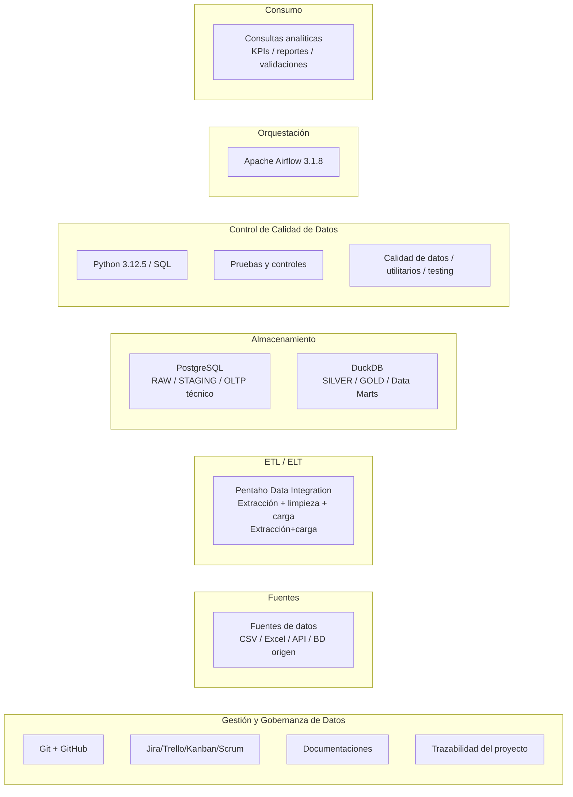

<div align="center">
  
  <h1>FPUNA · BIG DATA · LAB</h1>
  <h3>Repositorio académico y técnico para laboratorios de Big Data e Ingeniería de Datos</h3>
  <p>
    <strong>Universidad Nacional de Asunción</strong><br>
    <strong>Facultad Politécnica</strong><br>
    Departamento de Enseñanza de Informática<br>
    Asignatura: <strong>Electiva - Big Data</strong>
  </p>
</div>
---

## IDENTIFICACIÓN ACADÉMICA

| Identificación de la Asignatura | Especificación Institucional                                                  |
| ------------- | ----------------------------------------------------------------------------- |
| Institución   | Universidad Nacional de Asunción (UNA)                                        |
| Unidad Académica | Facultad Politécnica (FP-UNA)                                                 |
| Dependencia Académica | Departamento de Enseñanza de Informática (DEI)                                |
| Asignatura    | Electiva - Big Data                                                           |
| Carreras      | Ingeniería en Informática (IIN) / Licenciatura en Ciencias Informáticas (LCIk) |
| Plan de Estudios | Plan 2008                                             |
| Periodo académico | Primer Periodo 2026                                                           |
| Modalidad de Enseñanza | Presencial con apoyo de aula virtual EDUCA y herramientas colaborativas       |
| Carga Horaria Total | 112 horas totales (7 horas semanales: 3 teóricas y 4 prácticas)               |
| Turno / Sección | T / TQ                                                                        |
| Docente Encargado | Prof. Ing. Richard Daniel Jiménez Riveros                                     |
| Contacto Institucional | rjimenez@pol.una.py                                                           |
| Sede de Referencia | Campus Universitario, San Lorenzo - Paraguay                                  |
| Entorno de Laboratorio | Virtualización basada en WSL2 / Ubuntu Linux                                  |
| Estructura de Trabajo | `/opt/repo/fpuna-bigdata-lab` (Directorio de referencia local)                |
| IDE de Referencia | JetBrains PyCharm (Entorno de desarrollo recomendado)                         |

---

## 1. Propósito del repositorio

Este repositorio funciona como **landing page técnica y académica** del proyecto `FPUNA · BIGDATA · LAB`, y centraliza los recursos necesarios para construir, documentar y reproducir un **pipeline end-to-end de datos** con enfoque práctico, profesional y orientado a laboratorio.

El objetivo no es solamente almacenar código fuentes sueltos. Este repositorio debe servir para:

- Organizar los recursos para las clases de laboratorios, talleres, prácticas, pruebas de concepto y ensayos controlados.
- Versionar scripts SQL, flujos de Pentaho Data Integration (Kettle), DAGs de Airflow y utilitarios Python.
- Documentar decisiones de diseños, arquitectura, modelado y operación.
- Facilitar el trabajo colaborativo con Git/GitHub.
- Compartir las guías de actividades prácticas, los tutoriales de instalación y otras documentaciones clave para el entorno de trabajo.
- Sostener un proyecto final integrador con trazabilidad, reproducibilidad y criterios de calidad.

En términos formativos, este repositorio es el epicentro técnico de la asignatura **Electiva - Big Data**. Aquí se consolidan laboratorios, pruebas de concepto (PoC) y proyectos integradores enfocados en el **Data Engineering Lifecycle**. El objetivo es que el estudiante domine arquitecturas modernas de datos, desde la generación hasta el servicio de información.

---

## 2. Alcance del repositorio

Este repositorio está diseñado para soportar tres tipos de trabajo:

1. **Laboratorios guiados** de la asignatura.
2. **Pruebas de concepto (PoC)** para validar herramientas, integraciones y patrones de diseño.
3. **Proyecto integrador final** del curso, con arquitectura reproducible y documentación técnica.

> **Criterio general:** Git versiona artefactos fuente y documentación. No debe utilizarse como almacenamiento de logs operativos, datasets pesados, secretos ni salidas efímeras de ejecución.

---

## 3. Ecosistema digital de apoyo

| Plataforma          | Uso principal                                                                                                                       |
| ------------------- | ----------------------------------------------------------------------------------------------------------------------------------- |
| **EDUCA**           | Gestión formal del curso, materiales, consignas y actividades.                                                                      |
| **GitHub**          | Versionado, colaboración, issues, ramas, pull requests y documentación.                                                             |
| **Google Drive**    | Repositorio de archivos de gran tamaño disponible para su descarga en un entorno local.                                             |
| **Slack**           | Coordinación técnica entre equipos y soporte operativo.                                                                             |
| **Trello**          | Organizar y dar seguimiento a las tareas de un proyecto de datos, facilitando la colaboración del equipo y el control de cada fase. |
| **PyCharm**         | Desarrollo y navegación del proyecto.                                                                                               |
| **WhatsApp**        | Avisos breves y recordatorios operativos.                                                                                           |
| **DBeaver/pgAdmin** | Exploración, consulta y administración de bases de datos.                                                                           |
| **WSL2/Ubuntu**     | Entorno de virtualización basado en WSL2 ejecutando Ubuntu Linux.                                                                   |
| **drawsql.app**     | Herramienta online para diseñar, visualizar y compartir esquemas de bases de datos de forma colaborativa.                           |

> **Nota:** Para el entorno de trabajo se ha optado por utilizar exclusivamente herramientas y aplicaciones gratuitas o de código abierto, priorizando la accesibilidad, la colaboración comunitaria y la reducción de costos sin comprometer la calidad.

---

## 4. Stack tecnológico

> Los enlaces apuntan a documentación oficial o a la página oficial del producto.

| Componente                            | Rol en el proyecto                     | Descripción breve                                                                                                                                                                   | Documentación oficial                                                                 |
| ------------------------------------- | -------------------------------------- | ----------------------------------------------------------------------------------------------------------------------------------------------------------------------------------- | ------------------------------------------------------------------------------------- |
| **Pentaho Data Integration (Kettle)** | Integración / ETL                      | Herramienta *low-code* para extracción, transformación, parametrización y carga de datos mediante `jobs` y `transformations`.                                                       | [Pentaho Data Integration](https://pentaho.com/products/pentaho-data-integration/)    |
| **PostgreSQL 15**                     | OLTP / staging / control               | Base relacional para modelado operacional, staging, funciones SQL y lógica **PL/pgSQL**.                                                                                            | [PostgreSQL Docs](https://www.postgresql.org/docs/)                                   |
| **DuckDB**                            | OLAP / analítica                       | Motor analítico embebido orientado a consultas SQL sobre **datasets analíticos** y **marts** locales.                                                                               | [DuckDB Docs](https://duckdb.org/docs/)                                               |
| **Apache Airflow 3.1.8**              | Orquestación                           | **Orquesta** dependencias, calendarización, ejecución y monitoreo de pipelines.                                                                                                     | [Apache Airflow Docs](https://airflow.apache.org/docs/)                               |
| **Python 3.12.5**                     | Automatización / calidad / utilitarios | Scripts auxiliares, validaciones, pruebas y utilitarios del **pipeline**.                                                                                                           | [Python 3.12 Docs](https://docs.python.org/3.12/)                                     |
| **R 4.5 / RStudio**                   | Análisis Exploratorio de Datos (EDA)   | Entorno de programación y **análisis estadístico** con R 4.5, gestionado y visualizado mediante RStudio.                                                                            | [The R Project for Statistical Computing](https://www.r-project.org/)                 |
| **SQL**                               | Definición y explotación de datos      | DDL, DML, vistas, validaciones, consultas de control y **modelado** lógico/físico.                                                                                                  | [PostgreSQL SQL Commands](https://www.postgresql.org/docs/current/sql-commands.html)  |
| **PL/pgSQL**                          | Lógica procedural                      | Funciones, procedimientos y **automatización** sobre PostgreSQL.                                                                                                                    | [PL/pgSQL](https://www.postgresql.org/docs/current/plpgsql.html)                      |
| **Git**                               | Control de versiones                   | **Versionado** distribuido, ramas, historial, merges y trazabilidad.                                                                                                                | [Git Documentation](https://git-scm.com/doc)                                          |
| **GitHub**                            | Colaboración y repositorios remotos    | Hosting del **repositorio**, revisión de cambios, issues y documentación.                                                                                                           | [GitHub Docs](https://docs.github.com/)                                               |
| **WSL2 + Ubuntu**                     | Entorno de ejecución                   | Base Linux para **desarrollo local** reproducible sobre Windows.                                                                                                                    | [WSL Documentation](https://learn.microsoft.com/es-es/windows/wsl/)                   |
| **PyCharm**                           | IDE principal                          | **Gestión del proyecto**, edición de código, terminal integrada y navegación técnica.                                                                                               | [PyCharm Documentation](https://www.jetbrains.com/help/pycharm/)                      |
| **DBeaver**                           | Cliente SQL y modelado                 | Inspección de esquemas, **ejecución SQL** y administración visual de conexiones.                                                                                                    | [DBeaver Documentation](https://dbeaver.com/docs/dbeaver/)                            |
| **drawsql.app**                       | Modelado de Datos                      | Diseña, visualiza y colabora en **diagramas de relaciones** entre entidades para tus bases de datos.                                                                                | [DrawSQL APP](https://drawsql.app/)                                                   |
| **Metabase**                          | Visualización de datos                 | Herramienta de inteligencia de negocios y visualización de datos de código abierto, diseñada para que equipos puedan explorar, analizar y compartir información de manera sencilla. | [Metabase Website](https://www.metabase.com/)                                         |
| **Power BI**                          | Visualización de datos                 | Plataforma de análisis empresarial de Microsoft que permite transformar datos en información visual y procesable mediante paneles interactivos y reportes dinámicos.                | [Power BI Website](https://www.microsoft.com/es-es/power-platform/products/power-bi/) |

> **Nota:** Si necesita ayuda o soporte técnico relacionado con alguna de las herramientas o plataformas utilizadas en las prácticas de laboratorio o en el proyecto integrador final, puede suscribirse al espacio de trabajo de **Slack** en el canal de `#laboratorio`, disponible en la siguiente dirección: **[fpuna-bigdata.slack.com](https://fpuna-bigdata.slack.com)**.

---

## 5. ETL versus ELT: El dilema estratégico en proyectos de Big Data

La arquitectura de trabajo propuesta para este repositorio es **híbrida ETL/ELT**:

- **Extracción e integración** con Pentaho Data Integration (Kettle).
- **Persistencia operacional y staging** en PostgreSQL.
- **Carga y transformación analítica** en DuckDB.
- **Orquestación y control** con Apache Airflow.
- **Validaciones, pruebas y automatizaciones auxiliares** con Python.
- **Análisis de Datos Exploratorio (EDA)** con R.
- **Visualización y Dashboard** con Metabase o Power BI.

### 5.1 Diagrama conceptual de la arquitectura de datos



### 5.2 Ciclo completo de los datos: adquisición, almacenamiento, análisis y uso

1. **Fuente**: ingreso de datos desde archivos, APIs o bases operacionales.
2. **Ingesta / integración**: Pentaho Data Integration (Kettle) captura, estandariza y parametriza la carga.
3. **Persistencia operacional**: PostgreSQL recibe el dato fuente o intermedio.
4. **Transformación analítica**: DuckDB materializa estructuras analíticas y consultas OLAP.
5. **Orquestación**: Airflow ejecuta el pipeline por etapas y controla dependencias.
6. **Control de calidad**: Python + SQL ejecutan validaciones, pruebas y checks de consistencia.
7. **Consumo**: consultas, análisis, laboratorio, reporting o informe final.

---

## 6. Estructura del repositorio base

La siguiente estructura propone una organización clara, mantenible y escalable para el desarrollo de laboratorios, tutoriales, pruebas de concepto y proyectos integradores en el contexto de la asignatura **Big Data** de la **Facultad Politécnica (FP - UNA)**.
El objetivo es separar correctamente la documentación, los recursos visuales, los materiales de práctica, los experimentos, los proyectos, los datos, los artefactos técnicos y los archivos de configuración, facilitando tanto el trabajo académico como la evolución técnica del repositorio.

```text
fpuna-bigdata-lab/
├── README.md
├── LICENSE
├── requirements.txt
├── .gitignore
├── .env.sample
├── assets/
│   ├── diagramas/
│   ├── figuras/
│   ├── logos/
│   └── screenshots/
├── docs/
│   ├── tutoriales/
│   └── cheatsheets/
├── labs/
│   ├── entorno_base/
│   └── pentaho/
├── scripts/
│   └── python/
├── database/
│   ├── postgresql/
│   │   ├── ddl/
│   │   ├── seed/
│   │   └── tests_sql/
│   └── duckdb/
│       ├── ddl/
│       ├── marts/
│       └── tests_sql/
├── etl/
│   └── pentaho/
│       ├── jobs/
│       └── transformations/
├── orchestration/
│   └── airflow/
│       └── dags/
├── tests/
│   ├── unit/
│   ├── integration/
│   └── e2e/
├── data/
│   ├── raw/
│   ├── staging/
│   ├── duckdb/
│   └── export/
├── eda/
├── poc/
├── snippets/
├── projects/
├── reports/
└── config/
```

### 6.1 Descripción de archivos y directorios

#### Archivos principales del repositorio

* **`README.md`**
  Archivo principal de presentación del repositorio. Debe explicar el propósito general del laboratorio, el alcance académico, la estructura del proyecto, los prerrequisitos, la forma de uso y las instrucciones iniciales para estudiantes o colaboradores.

* **`requirements.txt`**
  Archivo de dependencias Python necesarias para ejecutar scripts, utilitarios y otros componentes del laboratorio. Permite instalar de manera reproducible las librerías requeridas del entorno.

* **`.gitignore`**
  Define los archivos y carpetas que no deben versionarse en Git, como entornos virtuales, cachés, archivos temporales, logs, artefactos generados, salidas locales del sistema y archivos del IDE.

* **`.env.sample`**
  Plantilla de variables de entorno del proyecto. Sirve como referencia para que cada usuario cree su propio archivo `.env` con parámetros sensibles o específicos de su entorno, sin exponer credenciales reales en el repositorio.

---

#### `assets/`

Directorio destinado a recursos estáticos utilizados en la documentación, presentaciones, tutoriales o reportes del proyecto.

* **`assets/diagramas/`**
  Contiene diagramas técnicos y conceptuales, como arquitecturas de datos, flujos ETL/ELT, modelos de componentes, pipelines y esquemas de integración.

* **`assets/figuras/`**
  Incluye imágenes de apoyo general, ilustraciones, gráficos explicativos y otros elementos visuales usados en materiales académicos o técnicos.

* **`assets/logos/`**
  Almacena logotipos institucionales, de herramientas, tecnologías o marcas relacionadas con la asignatura, las presentaciones y la identidad visual del repositorio.

* **`assets/screenshots/`**
  Contiene capturas de pantalla de entornos, configuraciones, ejecuciones, resultados o pasos de laboratorio que sirvan de apoyo visual en tutoriales y documentación.

---

#### `docs/`

Espacio reservado para documentación formal del repositorio y materiales base reutilizables.

* **`docs/tutoriales/`**
  Contiene tutoriales paso a paso, secuencias guiadas y prácticas estructuradas para desarrollar competencias técnicas de forma progresiva.

* **`docs/cheatsheets/`**
  Directorio para hojas de referencia rápida, resúmenes de comandos, sintaxis frecuente, atajos y recordatorios técnicos de uso recurrente en clases y laboratorios.

---

#### `labs/`

Directorio orientado al trabajo práctico de la asignatura. Aquí se organizan los materiales que los estudiantes utilizarán directamente en laboratorios y ejercicios guiados.

* **`labs/entorno_base/`**
  Subdirectorio destinado a tutoriales de instalación, configuración y validación del entorno base del laboratorio, como WSL2, Python, PostgreSQL, DuckDB u otras herramientas iniciales.

* **`labs/pentaho/`**
  Espacio para laboratorios y guías prácticas relacionadas con Pentaho Data Integration, orientadas a la construcción y comprensión de procesos ETL.

---

#### `scripts/`

Contiene scripts operativos y utilitarios para automatización de tareas, preparación de entornos, carga de datos, ejecución de procesos, validaciones y otras acciones repetitivas del laboratorio.

* **`scripts/python/`**
  Subdirectorio reservado para scripts Python de soporte, utilitarios de automatización, validaciones técnicas, transformaciones simples o pruebas auxiliares.

---

#### `database/`

Directorio destinado a los recursos relacionados con la gestión, diseño, definición y soporte técnico de los motores de base de datos utilizados en el repositorio.

* **`database/postgresql/`**
  Subdirectorio reservado para los recursos específicos de **PostgreSQL**, como scripts de creación de esquemas, tablas, funciones, procedimientos, cargas base y validaciones SQL.

  * **`database/postgresql/ddl/`**
    Contiene scripts de definición de estructuras, como bases de datos, esquemas, tablas, vistas, constraints y otros objetos relacionales.

  * **`database/postgresql/seed/`**
    Almacena datos semilla o cargas mínimas iniciales para pruebas, demostraciones o preparación del entorno.

  * **`database/postgresql/tests_sql/`**
    Incluye consultas y pruebas SQL para validar estructura, consistencia, integridad o resultados esperados en PostgreSQL.

* **`database/duckdb/`**
  Subdirectorio orientado a los recursos específicos de **DuckDB**, como scripts SQL, estructuras analíticas, marts y validaciones sobre el motor OLAP local.

  * **`database/duckdb/ddl/`**
    Contiene scripts de creación de tablas, vistas, esquemas analíticos y otros objetos estructurales en DuckDB.

  * **`database/duckdb/marts/`**
    Espacio para consultas o scripts de construcción de capas analíticas, tablas derivadas, modelos de consumo y data marts.

  * **`database/duckdb/tests_sql/`**
    Incluye pruebas SQL y consultas de verificación para validar resultados, calidad y consistencia de los datos en DuckDB.

---

#### `etl/`

Directorio destinado a los componentes operativos de ingestión y transformación de datos.

* **`etl/pentaho/`**
  Espacio reservado para artefactos de ETL desarrollados con Pentaho Data Integration.

  * **`etl/pentaho/jobs/`**
    Contiene archivos de tipo *job* (`.kjb`) para orquestar flujos ETL, secuencias de ejecución y dependencias entre procesos.

  * **`etl/pentaho/transformations/`**
    Contiene archivos de tipo *transformation* (`.ktr`) con las transformaciones de datos, extracciones, limpiezas, mapeos y cargas.

---

#### `orchestration/`

Directorio orientado a la orquestación de procesos y pipelines de datos.

* **`orchestration/airflow/`**
  Espacio reservado para componentes vinculados a Apache Airflow como herramienta de orquestación.

  * **`orchestration/airflow/dags/`**
    Contiene los DAGs del proyecto, con definiciones de tareas, dependencias, calendario y lógica de orquestación.

---

#### `tests/`

Directorio destinado a las pruebas técnicas y validaciones automatizadas del repositorio.

* **`tests/unit/`**
  Contiene pruebas unitarias orientadas a funciones, módulos o componentes aislados.

* **`tests/integration/`**
  Incluye pruebas de integración para validar la interacción entre varios componentes del proyecto.

* **`tests/e2e/`**
  Espacio para pruebas *end-to-end* que validan flujos completos desde la entrada hasta la salida esperada.

---

#### `data/`

Directorio destinado al almacenamiento y organización de los datos utilizados en el laboratorio, las pruebas de concepto y los proyectos del repositorio.

* **`data/raw/`**
  Contiene los datos originales o de origen, tal como fueron obtenidos desde archivos fuente, APIs, bases de datos u otros sistemas externos. Deben preservarse sin transformaciones.

* **`data/staging/`**
  Espacio intermedio para datos en proceso de limpieza, normalización, tipificación, enriquecimiento o preparación técnica.

* **`data/duckdb/`**
  Directorio reservado para archivos físicos de base de datos DuckDB, persistencias locales y artefactos analíticos asociados.

* **`data/export/`**
  Contiene salidas generadas por los procesos del proyecto, como archivos CSV, Parquet, Excel, resultados de consultas o datasets transformados listos para consumo.

---

#### `eda/`

Espacio destinado al **Análisis Exploratorio de Datos (Exploratory Data Analysis)**. Aquí se organizan notebooks, scripts, consultas SQL, perfiles de datos y análisis preliminares orientados a comprender estructura, calidad, distribución y comportamiento de los datos.

---

#### `poc/`

Directorio para **Pruebas de Concepto (Proof of Concept)**. Se utiliza para validar ideas, herramientas, integraciones, enfoques arquitectónicos o experimentos técnicos antes de incorporarlos a una solución más formal.

---

#### `snippets/`

Directorio para fragmentos reutilizables de código, consultas SQL, funciones auxiliares, plantillas y ejemplos breves que sirvan como apoyo rápido durante el desarrollo técnico.

* **`snippets/templates/`**
  Contiene plantillas maestras para tutoriales, cheatsheets, guías, informes u otros documentos con formato estándar del proyecto.

---

#### `projects/`

Contiene proyectos más estructurados y completos, incluyendo trabajos integradores, casos de estudio, mini-proyectos o implementaciones end-to-end desarrolladas en el marco de la asignatura.

---

#### `reports/`

Reservado para informes técnicos, entregables de análisis, reportes de resultados, hallazgos de laboratorio, evaluaciones de calidad de datos, conclusiones de experimentos y documentación de cierre de actividades o proyectos.

---

#### `config/`

Espacio destinado a archivos de configuración del proyecto, como parámetros de conexión, configuraciones por entorno, archivos YAML/JSON/TOML/INI, definiciones de variables, ajustes de herramientas y otros elementos que controlan el comportamiento técnico de la solución.


---

## 7. Puesta en Marcha (Setup Inicial)

> Este repositorio está pensado para ejecutarse en **WSL2 + Ubuntu** como entorno base de desarrollo local.

**Prerrequisitos:**
- Entorno virtual: WSL2.
- Sistema Linux: Ubuntu.
- Control de versión: Git.
- Python: 3.12.

### 7.1. Verificación rápida de dependencias principales

```bash
python --version
python -m venv --help
git --version
```

### 7.2. Clonar el repositorio como espacio de trabajo

```bash
# Crear directorio de trabajo
cd /opt
sudo mkdir -p repo
sudo chown -R $USER:$USER /opt/repo

# Verificación rápida
ls -lah /opt/repo
cd /opt/repo

# Clonar el repositorio desde GitHub
git clone <URL_DEL_REPO> fpuna-bigdata-lab
cd fpuna-bigdata-lab
```

### 7.3. Crear entorno virtual Python

```bash
cd /opt/repo/fpuna-bigdata-lab
python3 -m venv .venv
source .venv/bin/activate
pip install --upgrade pip
pip install -r requirements.txt
```

### 7.4. Abrir el proyecto en PyCharm (opcional)

- Abrir **PyCharm**.
- Seleccionar **Open**.
- Apuntar a la raíz del proyecto: `\\wsl.localhost\Ubuntu\opt\repo\fpuna-bigdata-lab`.
- Configurar como intérprete el entorno Python del proyecto: `/opt/repo/fpuna-bigdata-lab/.venv/bin/python3.12`.

### 7.5. Preparar variables de entorno

```bash
cp .env.sample .env
sudo nano /opt/repo/fpuna-bigdata-lab/.env
```

Editar `.env` con los parámetros reales del laboratorio, manteniendo la misma estructura de `.env.sample`:

```bash
export REPO_ENV=lab
export PROJECT_NAME=fpuna-bigdata-lab
export REPO_HOME=/opt/repo/${PROJECT_NAME}
export POSTGRES_HOST=localhost
export POSTGRES_PORT=5432
export POSTGRES_DBNAME=bigdata_lab
export POSTGRES_USER=postgres
export POSTGRES_PASSWORD=postgres
export POSTGRES_DBINIT=${REPO_HOME}/database/postgresql/ddl/db_init.sql
export DUCKDB_PATH=./data/duckdb/bigdata_lab.duckdb
export AIRFLOW_HOME=/opt/airflow/airflow_3.1.8
export PENTAHO_HOME=/opt/pentaho/data-integration
```

> **Importante:** el archivo `.env` es local y no debe versionarse en Git.

Cargar las variables de entorno:

```bash
source /opt/repo/fpuna-bigdata-lab/.env
```

---

## 8. Convenciones de ramas y commits

### 8.1. Estrategia de ramas

| Rama / patrón    | Uso |
|------------------|---|
| `main`           | Versión estable y presentable del proyecto |
| `develop`        | Integración de cambios en curso |
| `feature/<tema>` | Nueva funcionalidad |
| `fix/<tema>`     | Corrección de errores |
| `docs/<tema>`    | Cambios de documentación |
| `tests/<tema>`   | Pruebas y validaciones |
| `lab/<id>`       | Trabajo de laboratorio específico |
| `poc/<tema>`     | Prueba de concepto aislada |

### 8.2. Reglas mínimas

- No trabajar directamente sobre `main`.
- Todo cambio relevante debe quedar identificado en una rama con nombre explícito.
- Los commits deben ser pequeños, atómicos y trazables.
- Un commit no debe mezclar refactor, datos, documentación y lógica funcional si pueden separarse.

### 8.3. Convención sugerida de commits

Se recomienda usar el formato tipo **Conventional Commits**:

```text
feat(etl): add customer ingestion transformation
fix(sql): correct duplicate key handling in staging load
docs(readme): update execution steps for airflow 3.1.8
test(duckdb): add mart validation queries
refactor(python): isolate qa helpers into utils module
chore(repo): update gitignore and env example
```

### 8.4. Ejemplos válidos para estudiantes

```text
feat(lab03): implement pentaho job for csv ingestion
fix(postgresql): adjust sequence restart in seed script
docs(lab05): document airflow dag dependencies
test(quality): add null-check assertions for dimension tables
```

---

## 9. Estándares de nomenclatura

### 9.1. SQL

```text
001_db_init.sql
010_create_schema_raw.sql
020_create_schema_staging.sql
100_load_dim_customer.sql
900_qa_counts.sql
```

### 9.2. Pentaho

```text
trf_extract_customers_csv.ktr
trf_clean_orders.ktr
trf_load_dim_product.ktr
job_pipeline_end_to_end.kjb
```

### 9.3. Airflow

```text
dag_fpuna_bigdata_etl.py
dag_quality_checks.py
dag_refresh_duckdb_marts.py
```

### 9.4. Python

```text
run_checks.py
load_reference_data.py
validate_row_counts.py
```

---

## 10. Buenas prácticas

### 10.1. Diseño y arquitectura

- Definir claramente el rol de cada componente del stack antes de programar.
- Separar capa operacional (`PostgreSQL`) de capa analítica (`DuckDB`).
- Evitar mezclar PoC con solución oficial del proyecto.
- Diseñar flujos **idempotentes** siempre que sea posible.

### 10.2. Versionado

- No subir archivos `.env`, secretos, tokens o credenciales.
- No subir datasets pesados, bases locales, logs o artefactos temporales.
- Mantener `.gitignore` actualizado desde el primer día.

### 10.3. Datos y calidad

- Toda carga debe tener validación mínima: conteos, nulos, duplicados y llaves.
- Documentar supuestos de negocio y reglas de transformación.
- Registrar evidencias de ejecución en `reports/` cuando el laboratorio lo requiera.

### 10.4. Documentación

- El `README.md` en el directorio raíz es la página principal del repositorio.
- Los directorios principales podrán incorporar su propio `README.md` o documentación específica a medida que el repositorio evolucione.
- Toda decisión técnica importante debe quedar documentada en `docs/`.
- Toda estructura SQL o flujo Pentaho debe tener una breve explicación funcional.

### 10.5. Desarrollo local

- Trabajar preferentemente dentro del filesystem Linux de WSL, no en rutas montadas de Windows, salvo necesidad puntual.
- Usar rutas relativas dentro del proyecto cuando sea posible.
- Mantener separado el entorno del proyecto de los artefactos del sistema.

### 10.6. Entregables académicos

- El código debe ser ejecutable y explicable.
- La documentación debe permitir que otro estudiante reproduzca el flujo.
- Un laboratorio sin evidencia ni README técnico se considera incompleto.

---

## 11. Flujo recomendado de trabajo para estudiantes

1. Crear o actualizar rama de trabajo.
2. Leer la consigna del laboratorio.
3. Implementar scripts / flujos / validaciones.
4. Ejecutar pruebas mínimas.
5. Registrar evidencia relevante.
6. Actualizar README o documentación técnica.
7. Commit con mensaje claro.
8. Push y apertura de Pull Request si aplica.

---

## 12. Requisitos mínimos sugeridos para el estudiante

- Conocimientos básicos de SQL.
- Lectura básica de scripts Python.
- Uso inicial de Git y GitHub.
- Manejo básico de terminal Linux/Windows.
- Disposición para trabajar con laboratorios reproducibles y documentación técnica.

---

## 13. Estado del repositorio

Este repositorio se encuentra orientado a evolución incremental. Se recomienda declarar el estado del proyecto con alguno de estos valores:

- `draft`: estructura inicial del laboratorio o del proyecto.
- `in-progress`: desarrollo activo.
- `stable`: versión validada para uso en clase o demo.
- `archived`: material histórico o PoC cerrada.

---

## 14. Licencia y uso

Este repositorio se publica con fines académicos y de laboratorio. Antes de reutilizar o redistribuir materiales, revisar el archivo `LICENSE` y respetar las condiciones definidas para código, documentación y recursos institucionales.

---

## 15. Referencias

### 15.1. Bibliografía base del curso

1. Reis, J., & Housley, M. (2022). _Fundamentals of Data Engineering: Plan and Build Robust Data Systems_. O'Reilly Media.
2. Marz, N., & Warren, J. (2015). _Big Data: Principles and Best Practices of Scalable Real-Time Data Systems_. Manning Publications.
3. Kimball, R., & Ross, M. (2013). _The Data Warehouse Toolkit: The Definitive Guide to Dimensional Modeling_ (3ra ed.). Wiley.
4. Codd, E. F. (1970). A Relational Model of Data for Large Shared Data Banks. _Communications of the ACM_, 13(6), 377–387.
5. Joyanes Aguilar, L. (2014). _Big Data: Análisis de grandes volúmenes de datos en organizaciones_. Alfaomega/Marcombo.
6. Joyanes Aguilar, L. (2015). _Inteligencia de Negocios y Analítica de Datos_. McGraw-Hill Education.
7. Joyanes Aguilar, L. (2017). _Industria 4.0: La cuarta revolución industrial_. Alfaomega.
8. Wickham, H., & Grolemund, G. (2017). R for Data Science: Import, Tidy, Transform, Visualize, and Model Data. O'Reilly Media.

### 15.2. Documentación oficial del stack

- [Pentaho Data Integration Documentation](https://docs.pentaho.com/pdia-data-integration)
- [PostgreSQL Documentation](https://www.postgresql.org/docs/)
- [DuckDB Documentation](https://duckdb.org/docs/)
- [Apache Airflow Documentation](https://airflow.apache.org/docs/)
- [Python 3.12 Documentation](https://docs.python.org/3.12/)
- [R Manuals (CRAN)](https://cran.r-project.org/manuals.html)
- [RStudio IDE User Guide](https://docs.posit.co/ide/user/)
- [PostgreSQL SQL Commands](https://www.postgresql.org/docs/current/sql-commands.html)
- [PL/pgSQL Documentation](https://www.postgresql.org/docs/current/plpgsql.html)
- [Git Documentation](https://git-scm.com/doc)
- [GitHub Docs](https://docs.github.com/)
- [WSL Documentation](https://learn.microsoft.com/es-es/windows/wsl/)
- [PyCharm Documentation](https://www.jetbrains.com/help/pycharm/)
- [DBeaver Documentation](https://dbeaver.com/docs/dbeaver/)
- [DrawSQL Documentation](https://drawsql.app/docs)
- [Metabase Documentation](https://www.metabase.com/docs/latest/)
- [Power BI Documentation](https://learn.microsoft.com/es-es/power-bi/)

---

## Nota final

Este `README.md` debe evolucionar junto con las clases de laboratorios. Cada vez que cambie la estructura del repositorio, el flujo de ejecución, los nombres de DAGs, jobs Pentaho, scripts SQL o convenciones de trabajo, el README debe actualizarse en el mismo cambio para evitar desalineación entre la documentación y la implementación real.

---

## Autor
* **Prof. Ing. Richard Daniel Jiménez Riveros**
* **Correo:** [rjimenez@pol.una.py](mailto:rjimenez@pol.una.py)
* **Departamento:** Enseñanza de Informática (DEI)

<div align="center">
  <p><em>"Construyendo el futuro de los datos en la FP-UNA"</em></p>
  <strong>© 2026 · Campus UNA, San Lorenzo, Paraguay</strong>
</div>
